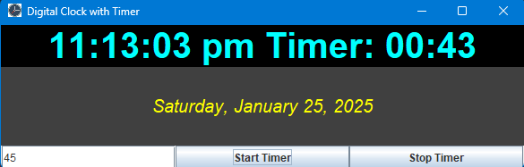

# Digital Clock With Timer For Students Exam Practice

This project is a digital clock application with a built-in timer, designed to help students practice for exams. The clock displays the current time and date, and the timer can be set manually to count down from a specified number of seconds.

## Features

- **Digital Clock**: Displays the current time in 12-hour format with AM/PM.
- **Date Display**: Shows the current date in "MMMM dd, yyyy" format.
- **Manual Timer**: Allows users to set a countdown timer for a specified number of seconds.
- **Start/Stop Timer**: Users can start and stop the timer as needed.

## Usage

1. **Run the Application**: Execute the `DigitalClock` class to start the application.
2. **Set Timer**: Enter the number of seconds in the input field and click the "Start Timer" button to begin the countdown.
3. **Stop Timer**: Click the "Stop Timer" button to stop the countdown at any time.

## Requirements

- Java Development Kit (JDK) 8 or higher
- Swing library (included in JDK)

## How to Run

1. **Clone the Repository**: 
    ```sh
    git clone https://github.com/atinbera/Digital-Clock-with-Timer.git
    ```
2. **Navigate to the Project Directory**:
    ```sh
    cd digital-clock-timer
    ```
3. **Compile the Code**:
    ```sh
    javac DigitalClock.java
    ```
4. **Run the Application**:
    ```sh
    java DigitalClock
    ```

## Screenshots




## License

This project is licensed under the MIT License. See the LICENSE file for details.

## Contributing

Contributions are welcome! Please open an issue or submit a pull request for any improvements or bug fixes.

## Contact

For any questions or suggestions, please contact [Atin](mailto:atinb.cse.jisu21@gmail.com).